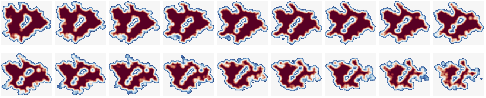

# 🎑 Con2SES: Grid-Context Convolutional Model for Efficient Molecular Surface Construction from Neighboring Point Clouds

This repository implements **Con2SES**, including data preprocessing, loading, model training, and evaluation. The code is written in Python using PyTorch, enabling rapid prototyping and experimentation. In addition to the Python implementation, a C++ version of the Con2SES inference pipeline using LibTorch is included in the **AmberTools25** release.




## Dependencies
**Requirements**

- Python >= 3.9

- Packages
    ```bash
    pip install -r requirements.txt
    ```

## Datasets
All datasets used for training and validation are located in the `datasets` folder. The grid data can be generated using the PBSA module in AMBER.

## Training
To train the model on all image files:
```bash
# Con2SES-2D
sh scripts/2d/bash/train_on_sparse.sh

# Con2SES-3D
sh scripts/3d/bash/train_3d.sh
```

To eval the model on desired image files:
```bash
# Con2SES-2D
python scripts/2d/test.py

# Con2SES-3D
sh scripts/3d/bash/test_3d.sh
```

